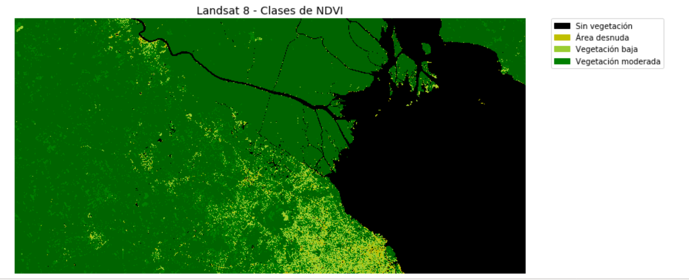

[Contenidos](../Contenidos.md) \| [Anterior (4 Objetos, pilas y colas)](04_Pilas_Colas.md) \| [Próximo (6 Cierre de la octava clase)](06_Cierre.md)

# 8.5 Teledetección

En este ejercicio vamos a trabajar con una imagen satelital obtenida por sensores a bordo del satélite Landsat8. Es un ejercicio optativo para entregar. Si querés hacelo y guardalo en el archiovo `NDVI.py`.

### Ejercicio 8.14: Optativo de teledetección
**Autora: [Mariela Rajngewerc](https://github.com/marielaraj/)**

La imagen original fue bajada de la página https://earthexplorer.gov. En esa página se pueden bajar imágenes con distinto nivel de pre-procesamiento. Para este ejercicio bajamos una imagen de nivel de procesamiento 2, esto quiere decir que los valores de los pixeles representan la reflectancia en superficie en distintas longitudes de onda. [Acá](https://www.usgs.gov/media/files/landsat-8-collection-1-land-surface-reflectance-code-product-guide) pueden encontrar el manual de estas imagenes donde les detallan la descripción tanto de los nombres de lor archivos como de los preprocesamiento que tienen realizados. 

Para este ejercicio hemos realizado un clip de cada una de las bandas originales de la imagen y ya multiplicamos a cada una de las bandas por el factor de escala indicado en el manual (0,0001).

Las longitudes de onda y la resoluciones de cada banda de la imágen se describen a continuación:

| Banda                        | Longitud de onda (nanómetros) | Resolución espacial (metros) |
| ---------------------------- | ----------------------------- | ---------------------------- |
| Banda 1 - Aerosoles          | 430 - 450                       | 30                           |
| Banda 2 - Azul               | 450 - 510                       | 30                           |
| Banda 3 - Verde              | 530 - 590                       | 30                           |
| Banda 4 - Rojo               | 640 - 670                       | 30                           |
| Banda 5 - Infrarrojo cercano | 850 - 880                       | 30                           |
| Banda 5 - Infrarrojo medio 1 | 1570 - 1650                   | 30                           |
| Banda 7 - Infrarrojo medio 2 | 2110 - 2290                   | 30                           |

Si desean abrir los datos de la imagen original en Python deberán bajar algunas librerías específicas para la manipulación de datos satelitales, por ejemplo: **gdal**. [Acá](https://www.github.com/marielaraj/pycon_tallerimgssat) hay un tutorial de los primeros pasos.

En la carpeta [clip](https://drive.google.com/file/d/1uoigo5s2xgWfbBQdUcJfOdhfYMNjZ8Ku/view?usp=sharing) encontrarán los datos que vamos a usar en los ejercicios. Cada banda del clip se encuentra en formato .npy

## Ejericios:

### Ejercicio 8.15: Ver una banda
a) Usá [numpy](https://numpy.org/doc/stable/reference/generated/numpy.load.html) para levantar cada una de las bandas y `plt.imshow(banda)` para verla.
¿Se ve correctamente? Podés ajustar el rango de visualización de colores usando los parámetros `vmin` y `vmax`. 

_Sugerencia_: Con `plt.hist(banda.flatten(),bins=100)` vas a ver un histograma de los valores en la matriz `banda`. Podés usarlo para guiarte en la búsqueda del rango que tiene sentido usar como vmin y vmax.

b) Escribí una función `crear_img_png(carpeta, banda)` que, dada una carpeta y un número de banda, muestre la imagen de dicha banda y la guarde en formato .png. Asegurate de incorporar un `colorbar` al lado de la imágen.

Tené en cuenta lo que hiciste en el punto a) para que se vea adecadamente.

### Ejercicio 8.16: 
Escribí ahora otra función, llamada `crear_hist_png(carpeta, banda, bins)` que, dada una carpeta, un número de banda y una cantidad de bins, muestre el histograma (con la cantidad de bins seleccionados) de los valores de dicha banda y la guarde en formato .png.

### Ejercicio 8.17: 
a) Usá las funciones `crear_img_png` y `crear_hist_png` que hiciste en los puntos anteriores para generar las imágenes e histogramas de cada banda.

b) ¿Qué banda o bandas parecieran tener histogramas bimodales, mostrando diferentes tipos de pixels? Elijí una de esas bandas y observando el histograma, seleccioná un umbral que te permita distinguir los dos tipos de píxels. Por ejemplo, podés crear una matriz del mismo tamaño de la banda donde a cada píxel le corresponda un 1 o un 0, 1 si está por arriba del umbral y 0 si no.

Graficá la imágen binaria así obtenida. ¿A qué corresponden los dos tipos de píxeles que pudiste distinguir tan fácilmente?

### Ejercicio 8.18: 
En este ejercicio vamos a trabajar con un índice: el Índice de Vegetación de Diferencia Normalizada, también conocido como [NDVI](https://es.wikipedia.org/wiki/%C3%8Dndice_de_vegetaci%C3%B3n_de_diferencia_normalizada) por sus siglas en inglés. Este índice, basado en la intensidad de la radiación de dos bandas  del espectro electromagnético que interactúan particularmente con la vegetación, aporta información sobre la cantidad, estado y desarrollo de la misma.

Para calcular el NDVI se utilizan las bandas espectrales Roja e Infrarroja, el cálculo se hace mediante la siguiente fórmula:

$$ \frac{INFRARROJO CERCANO-ROJO}{INFRARROJO CERCANO+ROJO} $$

a) Calcular el NDVI en una nueva matriz.

b) Categorizá los valores obtenidos en cada píxel de acuerdo a clases que nos sean más útiles y fáciles de interpretar. La tabla a continuación muestra una propuesta de categorías que podés considerar:

| Valor de NDVI    | Nombre de la clase  | Identificador de Clase | color       |
| ---------------- | ------------------- | ---------------------- | ----------- |
| < 0              | No vegetada         | 0                      | black       |
| entre 0 y 0.1    | Área desnuda        | 1                      | y           |
| entre 0.1 y 0.25 | Vegetación baja     | 2                      | yellowgreen |
| entre 0.25 y 0.4 | Vegetación moderada | 3                      | g           |
| >0.4             | Vegetación densa    | 4                      | darkgreen   |

Creá un `np.array` que le asigne a cada píxel el número dado por el *identificador de categoría* correspondiente según la tabla. Llamá *clases_ndvi* a la matriz así obtenida.

c) Generá un gráfico con `matplotlib` mostrando las clases obtenidas.

d) Crear un colorMap para lograr asignarle a cada clase el color sugerido en la tabla. Para esto podés usar la función ListedColormap incluída en `matplotlib.colors`  y crear un  colorMap (cmap).

e) Ponele una leyenda que indique el nombre de cada clase con el color asignado, para eso te sugerimos usar la función `mpatches` que se encuentra en `matplotlib.patches`. Para que puedas orientarte, te mostramos a continuación un ejemplo de resultado esperado:

[Contenidos](../Contenidos.md) \| [Anterior (4 Objetos, pilas y colas)](04_Pilas_Colas.md) \| [Próximo (6 Cierre de la octava clase)](06_Cierre.md)

