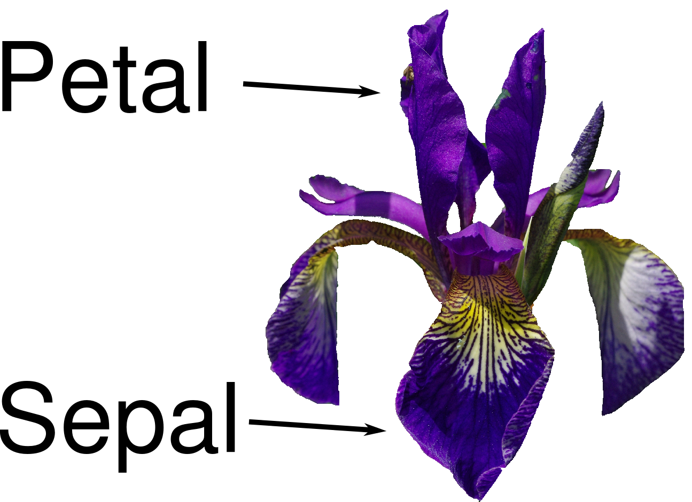
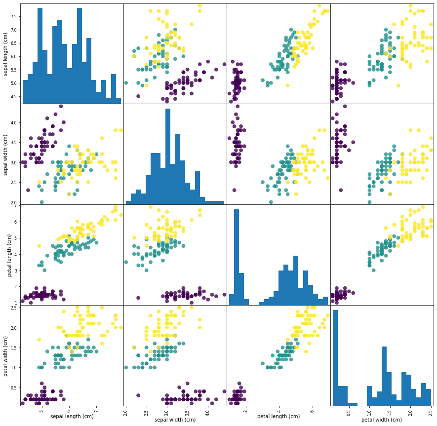
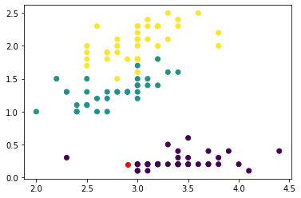

[Contenidos](../Contenidos.md) \| [Anterior (2 Divide y reinarás)](02_Divide_and_Conquer.md) \| [Próximo (4 Cierre de la clase de Ordenamiento)](04_Cierre.md)

# 11.3 Algoritmos de clasificación supervisada

En esta sección veremos un algoritmo de clasificación. Un problema de clasificación es un problema en el que tenemos algunas clases fijas (en nuestro ejemplo serán tres tipos de flores) y algunos atributos (medidas de los pétalos y sépalos, en nuestro ejemplo) a partir de los cuales queremos _inferir_ la clase. Típicamente el algoritmo de clasificación se _entrena_ con alguna parte de los datos para que _aprenda_ y luego se _evalúa_ cuán bien aprendió con el resto de los datos. Para esto hace falta tener un conjunto de datos _etiquetados_ (es decir, con la clase bien definida). Luego, si funciona bien, el algoritmo podrá usarse para etiquetar nuevos datos de los que no se conoce la clase.


En esta sección nos concentraremos en el entrenamiento y la evaluación de los algoritmo.

Trabajaremos con la librería sklearn de python que está diseñada para realizar tareas de aprendizaje automático. La misma trae algunos conjuntos de datos de ejemplo. Trabajaremos con el clásico ejemplo de **Clasificación de Especies de flores Iris** según medidas del pétalo y el sépalo.



## Veamos los datos


```python
from sklearn.datasets import load_iris
iris_dataset = load_iris()
```

Este dataset trae una serie de datos medidos de los pétalos y sépalos de 150 flores Iris y su clasificación en tres especies (setosa, versicolor y virginica). La idea es usar algunos de los datos de flores para entrenar un algoritmo y si podemos decir la especie de las otras flores usando solo sus medidas.

El dataset es un diccionario con diferentes datos. Esencialmente en "data" tiene un array con las medidas de ancho y largo de petalo y sepalo (atribuos, o "features" en inglés) de 150 flores  y en "target" tiene un numero (0, 1 o 2) que representa la especie de estas flores. Veamos un poco la estructura de estos datos. El diccionario tiene las siguientes claves:

```python
>>> print("Claves del diccionario iris_dataset:\n", iris_dataset.keys())
     dict_keys(['data', 'target', 'target_names', 'DESCR', 'feature_names', 'filename'])
```

Las flores se clasifican en tres:

```python
>>> print("Target names:", iris_dataset['target_names'])
    Target names: ['setosa' 'versicolor' 'virginica']
```

Y los atributos son cuatro por cada flor:

```python
>>> print("Feature names:\n", iris_dataset['feature_names'])
    Feature names:
     ['sepal length (cm)', 'sepal width (cm)', 'petal length (cm)', 'petal width (cm)']
```

Son 150 flores etiquetadas, con cuatro atributos cada una, en un array de numpy.  Las etiquetas son 0, 1 y 2 y se guardan también en un array:

```python
>>> print("Type of data:", type(iris_dataset['data']))
    Type of data: <class 'numpy.ndarray'>

>>> print("Shape of data:", iris_dataset['data'].shape)
    Shape of data: (150, 4)

>>> print("First five rows of data:\n", iris_dataset['data'][:5])
    First five rows of data:
     [[5.1 3.5 1.4 0.2]
     [4.9 3.  1.4 0.2]
     [4.7 3.2 1.3 0.2]
     [4.6 3.1 1.5 0.2]
     [5.  3.6 1.4 0.2]]

>>> print("Type of target:", type(iris_dataset['target']))
    Type of target: <class 'numpy.ndarray'>

>>> print("Shape of target:", iris_dataset['target'].shape)
    Shape of target: (150,)

>>> print("Target:\n", iris_dataset['target'])
    Target:
     [0 0 0 0 0 0 0 0 0 0 0 0 0 0 0 0 0 0 0 0 0 0 0 0 0 0 0 0 0 0 0 0 0 0 0 0 0
     0 0 0 0 0 0 0 0 0 0 0 0 0 1 1 1 1 1 1 1 1 1 1 1 1 1 1 1 1 1 1 1 1 1 1 1 1
     1 1 1 1 1 1 1 1 1 1 1 1 1 1 1 1 1 1 1 1 1 1 1 1 1 1 2 2 2 2 2 2 2 2 2 2 2
     2 2 2 2 2 2 2 2 2 2 2 2 2 2 2 2 2 2 2 2 2 2 2 2 2 2 2 2 2 2 2 2 2 2 2 2 2
     2 2]
```


## Training y testing

Como dijimos antes, vamos a entrenar un algoritmo y luego a evaluar su capacidad de clasificar. Para evitar sesgos y sobreajustes tenemos que partir al conjunto de datos en dos:

- una parte de los datos (training) será de entrenamiento del algoritmo y
- otra parte (testing) será usada para la evaluación.

La librería sklearn trae funciones que hacen esta separación (split) de forma aleatoria, como se ve a continuación (en este caso fijamos una semilla con random_state=0, luego lo sacaremos). Obviamente separamos tanto los atributos (features) como su clase (target). En este caso usaremos 75% para entrenar y 25% de los dados para evaluar.


```python
from sklearn.model_selection import train_test_split
X_train, X_test, y_train, y_test = train_test_split(
    iris_dataset['data'], iris_dataset['target'], random_state=0)
```

```python
>>> print("X_train shape:", X_train.shape)
>>> print("y_train shape:", y_train.shape)
    X_train shape: (112, 4)
    y_train shape: (112,)

>>> print("X_test shape:", X_test.shape)
>>> print("y_test shape:", y_test.shape)
    X_test shape: (38, 4)
    y_test shape: (38,)
```

## Viasualización de los datos de entranamiento

Hagamos primero unos gráficos para ver los datos y entender las correlaciones entre los atributos, usando un color diferente para cada especie de flor.


```python
# create dataframe from data in X_train
# label the columns using the strings in iris_dataset.feature_names
iris_dataframe = pd.DataFrame(X_train, columns=iris_dataset.feature_names)
# create a scatter matrix from the dataframe, color by y_train
pd.plotting.scatter_matrix(iris_dataframe, c=y_train, figsize=(15, 15),
                           marker='o', hist_kwds={'bins': 20}, s=60,
                           alpha=.8)
```



### Ejercicio 11.9: seaborn
Repetí  este gráfico pero usando seaborn en lugar de pandas para graficar.


## Modelar

Ahora vamos a construir nuestro primer modelo. Usaremos un algoritmo sencillo que se llama de "vecinos más cercanos" (_K-nearest neighbors_ en inglés, ver [wikipedia](https://es.wikipedia.org/wiki/K_vecinos_m%C3%A1s_pr%C3%B3ximos)). Lo entrenaremos con los datos de entrenamiento y al consultarle por un nuevo dato (de los de testing) lo que hará el algoritmo es buscar al dato de entrenamiento más cercano en el espacio de atributos y asignarle al nuevo dato la especie de esa flor. En otras palabras: cuando le preguntemos por la especie de una flor nueva va a contestarnos con la especie de la flor "más cercana" en el especio de atributos (ancho y largo del pétalo y el cépalo).


De esta forma el espacio de atributos queda dividido en regiones a las que se les asignará cada especie. En el siguiente gráfico puede verse una partición de un espacio de dos atributos y tres clases considerando un vecino más cercano (k=1) y entrenado con los datos del gráfico:


A un nuevo punto en este plano el clasificador así entrenado le asignará la clase correspondiente al color de fondo, que coincide con la clase del vecino más cercano.

Creamos una instancia de la clase `KNeighborsClassifier`


```python
from sklearn.neighbors import KNeighborsClassifier
knn = KNeighborsClassifier(n_neighbors=1)
```

Y la entrenamos con los datos de entrenamiento

```python
>>> knn.fit(X_train, y_train)
    KNeighborsClassifier(algorithm='auto', leaf_size=30, metric='minkowski',
                         metric_params=None, n_jobs=None, n_neighbors=1, p=2,
                         weights='uniform')
```

Listo, tenemos el clasificador entrenado. Ahora lo podemos usar para predecir la clase de una nueva flor a partir de sus cuatro medidas:

```python
>>> X_new = np.array([[5, 2.9, 1, 0.2]])
>>> print("X_new.shape:", X_new.shape)
    X_new.shape: (1, 4)
```

Plotiemos este nuevo punto en rojo y veamos su relación a los datos de entrenamiento en dos de los atributos.


```python
plt.scatter(X_train[:,1],X_train[:,3],c=y_train)
plt.scatter(X_new[:,1],X_new[:,3],c='red')
```




Acá se ve que el punto rojo esta cerca de la clase "setosa". Utilicemos ahora el algoritmo knn entrenado para que nos prediga la clase del punto `X_new`:


```python
>>> prediction = knn.predict(X_new)
>>> print("Predicción:", prediction)
>>> print("Nombre de la Especie Predicha:",
       iris_dataset['target_names'][prediction])
    Predicción: [0]
    Nombre de la Especie Predicha: ['setosa']
```

## Evaluación del modelo

Finalmente, usemos el 25% de los datos etiquetados que nos guardamos para evaluar cuán bien funciona nuestro clasificador.


```python
>>> y_pred = knn.predict(X_test)
>>> print("Predicciones para el conjunto de Test:\n", y_pred)
>>> print("Etiquetas originales de este conjunto:\n", y_test)
    Predicciones para el conjunto de Test:
     [2 1 0 2 0 2 0 1 1 1 2 1 1 1 1 0 1 1 0 0 2 1 0 0 2 0 0 1 1 0 2 1 0 2 2 1 0
     2]
    Etiquetas originales de este conjjuto:
     [2 1 0 2 0 2 0 1 1 1 2 1 1 1 1 0 1 1 0 0 2 1 0 0 2 0 0 1 1 0 2 1 0 2 2 1 0
     1]
```


Se ve que coinciden todos salvo el último. Podemos medir el éxito calculando la fracción de clasificaciones bien hechas (calculamos el promedio de "1 si está bien, 0 si está mal"):


```python
>>> print(y_pred == y_test)
>>> print("Test set score: {:.2f}".format(np.mean(y_pred == y_test)))
    [ True  True  True  True  True  True  True  True  True  True  True  True
      True  True  True  True  True  True  True  True  True  True  True  True
      True  True  True  True  True  True  True  True  True  True  True  True
      True False]
    Test set score: 0.97
```

O, directamente, usando el método `score` que ya viene en el clasificador:


```python
>>> print("Test set score: {:.2f}".format(knn.score(X_test, y_test)))
    Test set score: 0.97
```

## Pasando en limpio todo

Lo que hicimos hasta ahora fue:

    1) Separar los datos en dos conjuntos: test y train.
    2) definir un clasificador knn y entrenarlo con los datos de training.
    3) evaluar el clasificador con los datos de testing.


```python
X_train, X_test, y_train, y_test = train_test_split(
    iris_dataset['data'], iris_dataset['target'])

knn = KNeighborsClassifier(n_neighbors=1)
knn.fit(X_train, y_train)

print("Test set score: {:.2f}".format(knn.score(X_test, y_test)))
```

Observar que en este último fragmento de código el split en test y train es aleatorio, y va a dar resultados (scores) diferentes cada vez que lo corramos


## Ejercicios:

### Ejercicio 11.10: 
Leé sobre los [clasificadores basados en arboles de decisión](https://es.wikipedia.org/wiki/Aprendizaje_basado_en_%C3%A1rboles_de_decisi%C3%B3n) y luego usá el objeto clasificador `clf` (definido a continuación) como se usó `knn` en el ejemplo anterior (es decir, entrená el clasificador sobre el conjunto train y evaluálo sobre el conjunto test). Tanto `knn` como `clf` son clasificadores y heredan los métodos "fit", "predict" y "score" de forma que su uso es casi idéntico. Ventajas del polimorfismo que hablamos antes (ver [Ejercicio 8.7](../08_Clases_y_Objetos/02_Herencia.md#ejercicio-87-polimorfismo-en-acción)). ¿Qué clasificador dió mejores resultados?


```python
from sklearn.tree import DecisionTreeClassifier
clf = DecisionTreeClassifier()
```

### Ejercicio 11.11: 
La comparación anterior de los dos clasificadores puede resultar injusta ya que está basada en *una* partición del conjunto de datos es test y train que podría darle ventaja a uno u otro clasificador, arbitrariamente. 
    
Para evitar esto, repetí 100 veces lo siguiente y calculá el promedio de los scores:
        a) Partición del conjunto original en test y train aleatoriamente (sin fijar la semilla).
        b) Entrenamiento de ambos modelos (knn y clf) con el conjunto train resultante.
        c) Evaluación de ambos clasifcadores (score) con el conjunto test resultante.
        
Imprimí el promedio de los scores obtenidos y guardá el código en el archivo `comparacion.py` para entregar.


[Contenidos](../Contenidos.md) \| [Anterior (2 Divide y reinarás)](02_Divide_and_Conquer.md) \| [Próximo (4 Cierre de la clase de Ordenamiento)](04_Cierre.md)

